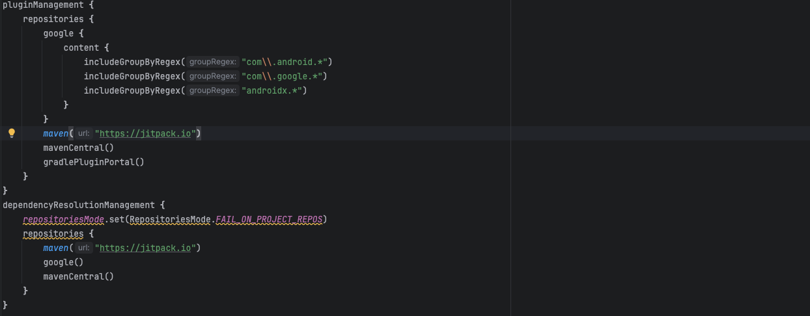
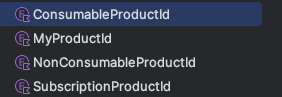
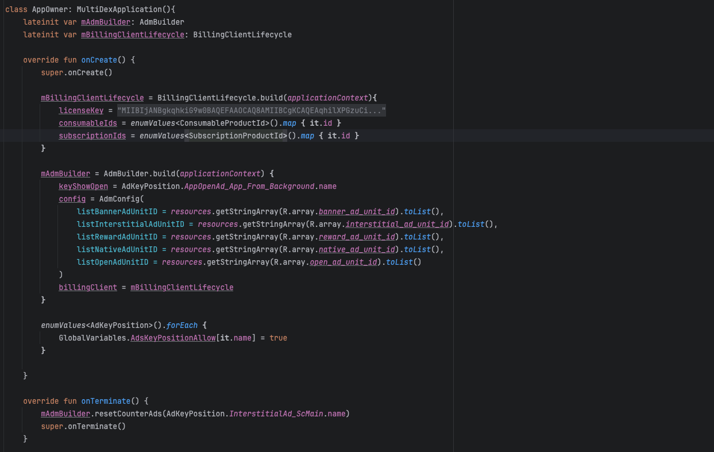

# GS_AD

## Installation
#### repositories
Vào mục setting.gradle.kts. Copy:
```gradle
maven { url 'https://jitpack.io' }
```
Như hình:



#### dependencies
Cài thư viện
```gradle
implementation("com.github.caprinixdev:ultra_a_d:1.0.12")
```
Thêm các thư viện
```gradle
implementation ("com.google.android.gms:play-services-ads:23.5.0")
implementation ("com.google.android.ump:user-messaging-platform:3.1.0")

implementation ("androidx.multidex:multidex:2.0.1")
implementation ("com.github.eriffanani:ContentLoader:1.2.0")
implementation ("com.facebook.shimmer:shimmer:0.5.0@aar")
implementation ("androidx.lifecycle:lifecycle-process:2.8.7")
```

## AndroidManifest
Copy các thẻ meta vào trong application
```manifest
<uses-permission android: name="android.permission.ACCESS_NETWORK_STATE" />
<uses-permission android: name="android.permission.INTERNET" />

<meta-data
     android:name="com.google.android.gms.ads.flag.OPTIMIZE_INITIALIZATION"
     android:value="true" />
<meta-data
     android:name="com.google.android.gms.ads.flag.OPTIMIZE_AD_LOADING"
     android:value="true" />
<meta-data
     android:name="com.google.android.gms.ads.AD_MANAGER_APP"
     android:value="true" />
<meta-data
     android:name="com.google.android.gms.ads.APPLICATION_ID"
     android:value="@string/app_ad_id" />
<meta-data
     android:name="com.google.android.gms.ads.flag.NATIVE_AD_DEBUGGER_ENABLED"
     android:value="false" />
```

## Cách sử dụng
Tạo 1 **AppOwner.kt** như example và thêm ***<application android:name=".AppOwner"*** vào ***AndroidManifest.xml*** 

Phải khởi tạo UMP trước khi sử dụng Ad, nên dùng ở trong màn Splash
```kotlin
private lateinit var ump: AdmUMP

ump = AdmUMP(this)

ump.initUMP(gatherConsentFinished = {
    runOnUiThread {
        //TODO: 
    }
})
```
### BannerAd
Gọi Load Ad:
```kotlin
private var bannerAd : AdmBannerAd? = null

bannerAd = AdmBannerAd(id = 0, currentActivity = this)
```

Listener
```kotlin
bannerAd?.onAdFailToLoaded = { admErrorType, errorMessage ->
    runOnUiThread {
        Log.d(TAG, admErrorType.name + "," + errorMessage)
    }
}
```

BannerAd Lifecycle
```kotlin
override fun onResume() {
     super.onResume()
     bannerAd?.resumeBanner()
}

override fun onPause() {
     super.onPause()
     bannerAd?.pauseBanner()
}

override fun onDestroy() {
    bannerAd?.destroyBanner()
    bannerAd = null
    super.onDestroy()
}
```

### NativeAd
Gọi Load Ad:
```kotlin
private var nativeAd: AdmNativeAd? = null

nativeAd = AdmNativeAd(id = 0, context = applicationContext, isFullScreen = false)
nativeAd?.loadAd(binding.nativeAdContainerView, R.layout.layout_native_ad)
```
Dùng Preload Ad thì tạo 1 object list và dùng populateNativeAdView:
```kotlin
//preload
object GroupNativeAd {
    var listOnBoardNativeAd: MutableList<AdmNativeAd?> = mutableListOf()
}

val admNativeAd = AdmNativeAd(
    id = 0,
    context = applicationContext,
    isFullScreen = false // true
)

admNativeAd.tag = 0 //để nhận biết ad

GroupNativeAd.listOnBoardNativeAd.add(admNativeAd)

//populateNativeAdView
val nativeAd = GroupNativeAd.listOnBoardNativeAd[position]
nativeAd?.populateNativeAdView(
    adContainerView = adContainer,
    layoutNativeAdView = R.layout.layout_native_ad_full
)
```

Listener
```kotlin
nativeAd?.onAdFailToLoaded = { admErrorType, errorMessage ->
    runOnUiThread {
        Log.d(TAG, admErrorType.name + "," + errorMessage)
    }
}
```

Destroy Ad
```kotlin
override fun onDestroy() {
    //destroy list
    val list = GroupNativeAd.listOnBoardNativeAd

    list.forEachIndexed { index, admNativeAd ->
        admNativeAd?.destroyNativeAd()
        list[index] = null
    }

    list.clear()
    
    //destroy nativeAd
    nativeAd?.destroyNativeAd()
    nativeAd = null
    super.onDestroy()
}
```

### InterstitialAd
Show Ad
```kotlin
private var interShowActivity2: AdmInterstitialAd? = null

interShowActivity2 = AdmInterstitialAd(id = 0, currentActivity = this)
interShowActivity2?.showPopupLoadAds { }
```

Listener
```kotlin
interShowActivity2?.onAdClosed = {
    runOnUiThread {
        startActivity(Intent(this@MainActivity, MainActivity2::class.java))
        }
    }

interShowActivity2?.onAdFailToLoaded = { admErrorType, errorMessage ->
    runOnUiThread {
        Log.d(TAG, admErrorType.name + "," + errorMessage)
    }
}
```
Sử dụng ***countToShowAds*** với trường hợp đếm tương tác nhiêu nút bấm trên 1 màn hình, với firstShowAd là số lần phải tương tác các nút bấm trong lần đầu tiên để show ad, loopShowAd là số lần khi tương tác lại các nút bấm đó để show lại ad :
```kotlin
 interShowActivity2?.countToShowAds(
    keyCounterAd = MAIN_COUNTER_AD,
    startAds = 3,
    loopAds = 2,
){}
```
Muốn reset lại số lần thì sử dụng ***resetCounterAds*** ở ***AppOwner.kt*** :
```kotlin
resetCounterAds(MainActivity.MAIN_COUNTER_AD)
```

Destroy Ad
```kotlin
override fun onDestroy() {
    interShowActivity2 = null
    super.onDestroy()
}
```

### RewardAd
```kotlin
private var rewardedAdRemoveAd: AdmRewardAd? = null

rewardedAdRemoveAd = AdmRewardAd(id = 0, currentActivity = this)
```

Listener
```kotlin
rewardedAdRemoveAd?.onHaveReward = {
    runOnUiThread {
        PreferencesManager.getInstance().removeAds(true)
        checkSubToUpdateUI()
    }
}

rewardedAdRemoveAd?.onAdFailToLoaded = { admErrorType, errorMessage ->
    runOnUiThread {
        Log.d(TAG, admErrorType.name + "," + errorMessage)
    }
}
```

Destroy Ad
```kotlin
override fun onDestroy() {
    rewardedAdRemoveAd = null
    super.onDestroy()
}
```

### OpenAd
Để xuất hiện OpenAd thì sử dụng ***GlobalVariables.canShowOpenAd = true***. ví dụ:
```kotlin
override fun onStart() {
     super.onStart()
     GlobalVariables.canShowOpenAd = true
}
```

OpenAd ở các màn **Splash, Subscription, OnBoard** ko nên hiện thì để ***GlobalVariables.canShowOpenAd = false***

### Lưu ý
Xem Reward Remove Ad sử dụng như sau, bỏ remove ad thì set ***false*** :
```kotlin
PreferencesManager.getInstance().removeAds(true) // false
```

Sử dụng isRemoveAds() để check remove ad:
```kotlin
PreferencesManager.getInstance().isRemoveAds()
```

# Sub
## Cách sử dụng
Tạo các 4 file Product Id như hình:


Tạo 1 **AppOwner.kt** như hình:


Khởi tạo ***BillingClientLifecycle*** trong các activity
```kotlin
private val mBillingClientLifecycle: BillingClientLifecycle? get() { return  (application as AppOwner).mBillingClientLifecycle ?: null}
```

Gọi ***setListener*** trong onCreate ở các activity như sau:
```kotlin
mBillingClientLifecycle?.setListener(this, object : OnBillingListener {
            override fun onPurchasedProductsFetched(purchaseInfos: List<PurchaseInfo>) {
                super.onPurchasedProductsFetched(purchaseInfos)
            }
        })
```
Dùng ***removeListener*** trước finish 1 activity như sau:
```kotlin
     mBillingClientLifecycle?.removeListener(this)
     finish()
```
Đối với activity main như sau:
```kotlin
override fun onDestroy() {
     mBillingClientLifecycle?.removeListener(this)
     super.onDestroy()
}
```

Lấy giá item Sub và iap như sau:
```kotlin
mBillingClientLifecycle.getSubscriptionPrice(SubscriptionProductId.Weekly.id)
```
```kotlin
mBillingClientLifecycle.getIAPPrice(ConsumableProductId.Lifetime.id)
```

Mua gói Sub và Lifetime sử dụng như sau:
```kotlin
mBillingClientLifecycle.subscribe(this@SubscriptionActivity, ConsumableProductId.Lifetime.id)
```
```kotlin
mBillingClientLifecycle.purchaseLifetime(this@SubscriptionActivity, SubscriptionProductId.Weekly.id)
```

Sử dụng ***fetchSubPurchasedProducts*** để check Sub có tồn tại ko
```kotlin
mBillingClientLifecycle?.fetchSubPurchasedProducts()
```

Sử dụng isSUB() để check sub:
```kotlin
PreferencesManager.getInstance().isSUB()
```

